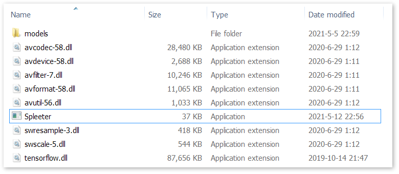

# SpleeterMsvcExe

[](https://github.com/wudicgi/SpleeterMsvcExe/releases/latest) [](https://raw.githubusercontent.com/wudicgi/SpleeterMsvcExe/master/LICENSE)

## 1. Introduction ([中文](#1-简介))



SpleeterMsvcExe is a Windows command line program for [Spleeter](https://github.com/deezer/spleeter), which can be used directly.

It is written in pure C language, using ffmpeg to read and write audio files, and using Tensorflow C API to make use of Spleeter models. There is no need to install a Python environment, and it does not contain anything related to Python.

Furthermore, SpleeterMsvcExe has reduced memory usage through segmented processing, allowing it to handle single audio file over 30 minutes. With the length-extending process, all segments can be seamlessly concatenated.

## 2. Usage

Download the latest release version program, and extract.

Drag-and-drop the song.mp3 file to `Spleeter.exe`, or execute the following command:

```
Spleeter.exe song.mp3
```

It will split song.mp3 into two tracks: song.vocals.mp3 and song.accompaniment.mp3

If it reports missing DLL files, please install [Microsoft Visual C++ Redistributable for Visual Studio 2015, 2017 and 2019 (x64)](https://aka.ms/vs/16/release/vc_redist.x64.exe) ([Source Page](https://support.microsoft.com/en-us/topic/the-latest-supported-visual-c-downloads-2647da03-1eea-4433-9aff-95f26a218cc0)).

## 3. Help and usage examples

```
Usage: Spleeter.exe [options] <input_file_path>

Options:
    -m, --model         Spleeter model name (i.e. the folder name in models folder)
                            2stems, 4stems, 5stems-22khz, ..., default is 2stems
    -o, --output        Output file path format
                        Default is empty, which is equivalent to $(DirPath)\$(BaseName).$(TrackName).$(Ext)
                        Supported variable names and example values:
                            $(FullPath)                 D:\Music\test.mp3
                            $(DirPath)                  D:\Music
                            $(FileName)                 test.mp3
                            $(BaseName)                 test
                            $(Ext)                      mp3
                            $(TrackName)                vocals,drums,bass,...
    -b, --bitrate       Output file bitrate (unused for lossless or constant quantizer encoding)
                            128k, 192000, 256k, ..., default is 256k
    -t, --tracks        Output track list (comma separated track names)
                        Default value is empty to output all tracks
                        Available track names:
                            input, vocals, accompaniment, drums, bass, piano, other
                        Examples:
                            accompaniment               Output accompaniment track only
                            vocals,drums                Output vocals and drums tracks
                            mixed=vocals+drums          Mix vocals and drums as "mixed" track
                            vocals,acc=input-vocals     Output vocals and accompaniment for 4stems model
    --overwrite         Overwrite when the target output file exists
    --verbose           Display detailed processing information
    --debug             Display debug information
    -h, --help          Display this help and exit
    -v, --version       Display program version and exit

Examples:
    Spleeter.exe -m 2stems song.mp3
    - Splits song.mp3 into 2 tracks: vocals, accompaniment
    - Outputs 2 files: song.vocals.mp3, song.accompaniment.mp3
    - Output file format is same as input, using default bitrate 256kbps

    Spleeter.exe -m 4stems -o result.m4a -b 192k song.mp3
    - Splits song.mp3 into 4 tracks: vocals, drums, bass, other
    - Outputs 4 files: result.vocals.m4a, result.drums.m4a, ...
    - Output file format is M4A, using bitrate 192kbps

    Spleeter.exe --model 5stems-22khz --bitrate 320000 song.mp3
    - Long option example
    - Using the model of which upper frequency limit is 22kHz
    - Splits song.mp3 into 5 tracks
```

## 4. Acknowledgements

- Thanks to [Deezer](https://www.deezer.com/) for open-sourced the [Spleeter](https://github.com/deezer/spleeter) project.

- Thanks to [Guillaume Vincke](https://github.com/gvne) for bringing out the [spleeterpp](https://github.com/gvne/spleeterpp) project. The Spleeter processing part of this project made reference to its implementation, and used the converted Spleeter model files provided by spleeterpp project.

---

## 1. 简介


SpleeterMsvcExe 是 [Spleeter](https://github.com/deezer/spleeter) 的 Windows 命令行程序，可直接运行使用。

纯 C 语言编写，使用 ffmpeg 读取和写入音频文件，使用 Tensorflow C API 调用 Spleeter 模型。无需安装 Python 环境，内部也不包含任何 Python 相关内容。

此外，SpleeterMsvcExe 还通过分段处理减少了内存占用，它可以处理长度超过 30 分钟的单个音频文件。分段时有长度扩展处理，使各分段可无缝连接，合并结果无可感知的差异。

## 2. 使用方法

下载最新的 release 版本程序，解压到任意位置。

将 song.mp3 文件拖拽到 `Spleeter.exe` 上，或在命令行执行

```
Spleeter.exe song.mp3
```

即可将 song.mp3 分离为人声 (song.vocals.mp3) 和伴奏 (song.accompaniment.mp3) 两个音轨。

更多参数请查看帮助和使用示例。

如果运行时报告缺少 DLL 文件，请安装 [Microsoft Visual C++ Redistributable for Visual Studio 2015, 2017 and 2019 (x64)](https://aka.ms/vs/16/release/vc_redist.x64.exe) ([来源页面](https://support.microsoft.com/en-us/topic/the-latest-supported-visual-c-downloads-2647da03-1eea-4433-9aff-95f26a218cc0))。

## 3. 帮助和使用示例

```
使用: Spleeter.exe [选项] <输入文件路径>

选项:
    -m, --model         Spleeter 模型名称 (也就是 models 目录中的子目录名)
                            2stems, 4stems, 5stems-22khz, ..., 默认为 2stems
    -o, --output        输出文件路径格式
                        默认为空，等效于 $(DirPath)\$(BaseName).$(TrackName).$(Ext)
                        支持的变量名和相应的示例值如下:
                            $(FullPath)                 D:\Music\test.mp3
                            $(DirPath)                  D:\Music
                            $(FileName)                 test.mp3
                            $(BaseName)                 test
                            $(Ext)                      mp3
                            $(TrackName)                vocals,drums,bass,...
    -b, --bitrate       输出文件的比特率 (对于无损或恒定量化值的编码，不会被使用)
                            128k, 192000, 256k, ..., 默认为 256k
    -t, --tracks        输出轨道列表 (逗号分隔的轨道名称列表)
                        默认为空，输出所有轨道
                        可用的轨道名称:
                            input, vocals, accompaniment, drums, bass, piano, other
                        示例:
                            accompaniment               只输出伴奏轨道 (使用 2stems 模型时)
                            vocals,drums                输出人声和鼓两个轨道
                            mixed=vocals+drums          将人声和鼓混合为一个名为 mixed 的轨道输出
                            vocals,acc=input-vocals     在使用 4stems 模型时，输出人声和伴奏轨道
    --overwrite         当目标输出文件已存在时直接覆盖
    --verbose           显示详细的处理过程信息
    --debug             显示调试信息
    -h, --help          显示帮助文本并退出
    -v, --version       显示程序版本号并退出

示例:
    Spleeter.exe -m 2stems song.mp3
    - 将 song.mp3 分离为 2 个音轨: vocals, accompaniment (人声，伴奏)
    - 输出 2 个文件: song.vocals.mp3, song.accompaniment.mp3
    - 输出文件使用和输入相同的 MP3 格式，比特率为默认的 256kbps

    Spleeter.exe -m 4stems -o result.m4a -b 192k song.mp3
    - 将 song.mp3 分离为 4 个音轨: vocals, drums, bass, other (人声，鼓，贝斯，其它)
    - 输出 4 个文件: result.vocals.m4a, result.drums.m4a, ...
    - 输出文件使用 M4A 格式，比特率为 192kbps

    Spleeter.exe --model 5stems-22khz --bitrate 320000 song.mp3
    - 使用长选项 (long option) 参数的示例
    - 使用频率上限为 22kHz 的模型，将 song.mp3 分离为 5 个音轨
```

## 4. 致谢

- 感谢 [Deezer](https://www.deezer.com/) 开源了 [Spleeter](https://github.com/deezer/spleeter) 项目。

- 感谢 [Guillaume Vincke](https://github.com/gvne) 带来了 [spleeterpp](https://github.com/gvne/spleeterpp) 项目。本项目的 Spleeter 处理部分代码参考其实现，并使用了其提供的转换后的 Spleeter 模型文件。
